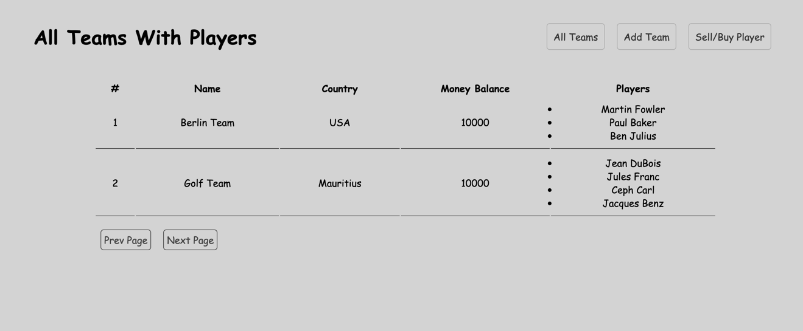
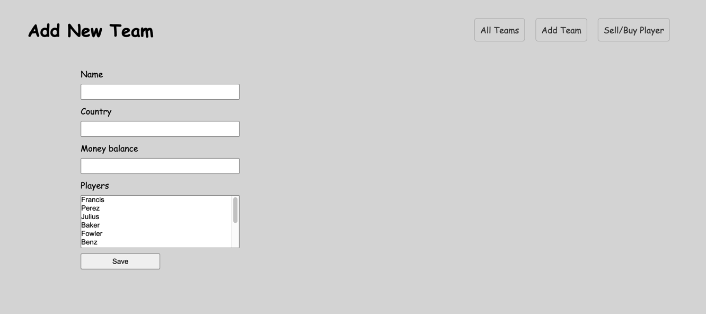
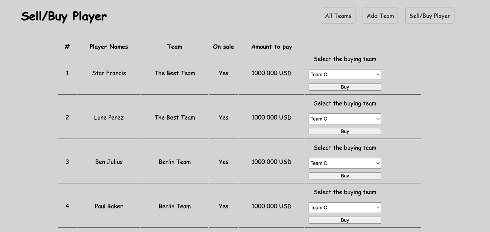

## FB Teams

A Symfony Application where you can create and list Teams, Player; Buy/Sell Players in a football team.

(Shows the list of all teams With Players)

(Shows the page where to add a new team)

(Shows the page where to buy a team player)

### Tech stack and app foundation

- PHP 8.1 or higher, Symfony 6
- HTML, CSS, Twig
- Postgres
- Docker (optional)

### How to run the app

1. Have the correct PHP version (8.1 or higher) and composer installed
2. Clone the project from Github 
3. `cd` in the project root folder and run `composer install` to have all dependencies installed in the application
4. Create a `.env` file in the root folder and configure the `DATABASE_URL` key. then run the Symfony command to create the database.
5. Run as well `npm install` and `npm run dev` to install npm packages and build all assets
6. Run `symfony console doctrine:migrations:migrate` to create the tables in the database and `symfony console doctrine:fixtures:load` to have the Players seeded in the database table. see the `PlayerFixtures` class
7. Run `symfony server:start` , visit the app on the running port.

🙏